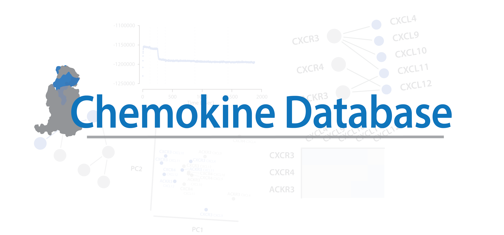

```{r setup, include=FALSE}
knitr::opts_chunk$set(echo = FALSE)
```

```{r   echo=FALSE, layout='l-body', out.width='100%'}

```

## Check out the paper!

### Validation and Discovery of Chemokine – Chemokine Receptor Pairs with High-Throughput Protein Modeling

Roman R. Schlimgen, Yushin Kim, Michael T. Zimmerman, Davin R. Jensen, Francis C. Peterson, Martyna Szpakowska, Andy Chevigné, Brian F. Volkman
